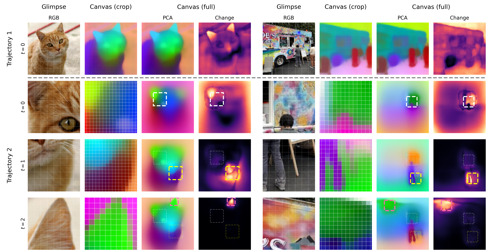

<p align="center">
  
</p>

<h1 align="center">CanViT: Toward Active-Vision Foundation Models (NeurIPS 2026)</h1>

<p align="center">
  <a href="https://yberreby.com">Yohaï-Eliel Berreby</a><sup>1,2</sup> ·
  <a href="https://mila.quebec/en/directory/sabrina-du">Sabrina Du</a><sup>1,2</sup> ·
  <a href="https://audrey-durand.fsg.ulaval.ca/en">Audrey Durand</a><sup>2,3</sup> ·
  <a href="https://m2b3.github.io/">B. Suresh Krishna</a><sup>1</sup>
  <br>
  <sup>1</sup>McGill University · <sup>2</sup>Mila – Quebec AI Institute · <sup>3</sup>Université Laval
</p>

<p align="center">
  <picture>
    <source media="(prefers-color-scheme: dark)" srcset="site/assets/logos/neurips-dark.svg">
    
  </picture>
</p>

<p align="center">
  <a href="https://m2b3.github.io/CanViT/"></a>
  <a href="https://arxiv.org/abs/2603.22570"></a>
  <a href="https://huggingface.co/canvit"></a>
  <a href="https://pypi.org/project/canvit-pytorch/"></a>
  <a href="https://pepy.tech/projects/canvit-pytorch"></a>
</p>

<p align="center">
  
</p>

This repository holds the reference PyTorch implementation of CanViT, with pretraining, task specialization and
evaluation; the package is [`canvit-pytorch`](https://pypi.org/project/canvit-pytorch/) on PyPI.
The native MLX and JAX/Flax NNX packages live under [`canvit-mlx/`](canvit-mlx/) and [`canvit-nnx/`](canvit-nnx/) and
share [`canvit-core/`](canvit-core/).

## News

- **2026-09-26**: canvit-pytorch 0.2, a refactoring release; updated checkpoints pushed to the Hub. Code written
  for 0.1: see [Troubleshooting](#troubleshooting).
- **2026-09-24**: 🎉 Accepted at NeurIPS 2026!
- **2026-05-16**: Preprint v2 ([arXiv:2603.22570v2](https://arxiv.org/abs/2603.22570v2)), adding the 84.5% ImageNet-1k fine-tuning result and the effect of canvas resolution.
- **2026-04-06**: First finetuned IN1k checkpoint: [`canvitb16-add-vpe-finetune-g128px-s512px-in1k-2026-04-06`](https://huggingface.co/canvit/canvitb16-add-vpe-finetune-g128px-s512px-in1k-2026-04-06), with new `CanViTForImageClassification` API.
  - 🎉 CanViT sets a new SOTA on **active-vision IN1k classification**, with **84.5% top-1 accuracy**, up from [AdaptiveNN](https://github.com/LeapLabTHU/AdaptiveNN)'s previous best of 82.2%.
- **2026-03-23**: Preprint v1 ([arXiv:2603.22570v1](https://arxiv.org/abs/2603.22570v1)).
  - 🎉 CanViT sets a new SOTA on **active ADE20K segmentation**, with **45.9% ADE20K mIoU**, obtained using linear probing from frozen weights.
- **2026-02-18**: Initial code and [first pretrained checkpoint](https://huggingface.co/canvit/canvitb16-add-vpe-pretrain-g128px-s512px-in21k-dv3b16-2026-02-02) release.

## Abstract

**Active computer vision** promises efficient, biologically plausible perception through sequential, localized glimpses, but lacks scalable general-purpose architectures and pretraining pipelines, leaving **Active-Vision Foundation Models (AVFMs)** underexplored. We introduce **CanViT**, the first task- and policy-agnostic AVFM. CanViT uses scene-relative RoPE to bind a retinotopic Vision Transformer backbone and a spatiotopic scene-wide latent workspace, the *canvas*. Efficient interaction with this high-capacity working memory is supported by **Canvas Attention**, a novel asymmetric cross-attention mechanism. We decouple *thinking* (backbone-level) and *memory* (canvas-level), eliminating canvas-side self-attention and fully-connected layers to achieve fast sequential inference and scalability to high output resolutions. We propose a label-free active vision pretraining scheme, **policy-agnostic passive-to-active dense latent distillation**: reconstructing scene-wide DINOv3 embeddings from sequences of low-resolution glimpses with randomized locations, zoom levels, and lengths. We pretrain CanViT-B from a random initialization on 13.2 million ImageNet-21k scenes—an order of magnitude more than previous active models—and 1 billion random glimpses, in 166 hours on a single H100. On ADE20K segmentation, a frozen CanViT-B achieves <span data-macro="adeSingleGlimpseMiou">38.5</span>% mIoU in a single low-resolution glimpse, outperforming the best active model's <span data-macro="adeBestPriorMiou">27.6</span>% with <span data-macro="adeCheapestBeatFlopRatio">20</span>x fewer inference FLOPs as well as its FLOP- or input-matched DINOv3 teacher. Given additional glimpses, CanViT-B reaches <span data-macro="adeBestMiou">45.9</span>% ADE20K mIoU. On ImageNet-1k classification, CanViT-B also sets a new active-vision state of the art, with <span data-macro="inkFinetunedBest">84.5</span>% top-1 accuracy after fine-tuning. CanViT generalizes to longer rollouts, larger scenes, and new policies. Our work narrows the wide gap between passive and active computer vision, demonstrating the potential of task- and policy-agnostic AVFM pretraining.

## Checkpoints

The checkpoints are on Hugging Face under [`canvit`](https://huggingface.co/canvit); `from_pretrained` loads the
PyTorch ones.

| Checkpoint | Description |
|------------|-------------|
| [`canvitb16-add-vpe-pretrain-g128px-s512px-in21k-dv3b16-2026-02-02`](https://huggingface.co/canvit/canvitb16-add-vpe-pretrain-g128px-s512px-in21k-dv3b16-2026-02-02) | CanViT-B pretrained on ImageNet-21k by policy-agnostic passive-to-active dense latent distillation from DINOv3 ViT-B: the paper's model |
| [`canvitb16-add-vpe-pretrain-g128px-s512px-in1k-dv3b16-2026-06-22`](https://huggingface.co/canvit/canvitb16-add-vpe-pretrain-g128px-s512px-in1k-dv3b16-2026-06-22) | CanViT-B pretrained the same way on ImageNet-1k only |
| [`canvitb16-add-vpe-finetune-g128px-s512px-in1k-2026-04-06`](https://huggingface.co/canvit/canvitb16-add-vpe-finetune-g128px-s512px-in1k-2026-04-06) | The ImageNet-21k model fine-tuned for ImageNet-1k classification, <span data-macro="inkFinetunedBest">84.5</span>% top-1 (trained on TPU v6e via [torch_xla](https://github.com/pytorch/xla)) |
| [`canvitb16-add-vpe-finetune-g128px-s512px-in1k-2026-07-24`](https://huggingface.co/canvit/canvitb16-add-vpe-finetune-g128px-s512px-in1k-2026-07-24) | The ImageNet-21k model fine-tuned again with the same recipe, by a JAX/Flax NNX trainer |
| [`canvitb16-add-vpe-finetune-g128px-s512px-in1k-from-in1k-2026-07-24`](https://huggingface.co/canvit/canvitb16-add-vpe-finetune-g128px-s512px-in1k-from-in1k-2026-07-24) | The ImageNet-1k model fine-tuned with the same recipe, by the same trainer |

Collections:

- [CanViT ADE20K segmentation probes](https://huggingface.co/collections/canvit/canvit-ade20k-segmentation-probes-pytorch) and [DINOv3 ADE20K segmentation probes](https://huggingface.co/collections/canvit/dinov3-ade20k-segmentation-probes-pytorch)
- [DINOv3 ImageNet-1k probes](https://huggingface.co/collections/canvit/dinov3-imagenet-1k-probes-pytorch), which the frozen classification path uses
- [CanViT pretraining ablations](https://huggingface.co/collections/canvit/canvit-pretraining-ablations-pytorch), the paper's ablation backbones
- [JAX / Flax NNX](https://huggingface.co/collections/canvit/canvit-jax-flax-nnx) and [MLX](https://huggingface.co/collections/canvit/canvit-mlx) copies, for the ports under [Repository layout](#repository-layout)

## Quickstart

We recommend [`uv`](https://docs.astral.sh/uv/) for dependency management.

```bash
uv add canvit-pytorch   # or: pip install canvit-pytorch
```

```python
from canvit_pytorch import CanViTForPretraining, Viewpoint, sample_at_viewpoint
from canvit_pytorch.preprocess import preprocess
from PIL import Image
import torch

# CanViT is integrated with the HuggingFace Hub.
model = CanViTForPretraining.from_pretrained(
    "canvit/canvitb16-add-vpe-pretrain-g128px-s512px-in21k-dv3b16-2026-02-02"
).eval()

# Replace with the image of your choice
image = Image.open("canvit-pytorch/test_data/Cat03.jpg").convert("RGB")
image = preprocess(512)(image)
image = image.unsqueeze(0)  # [1, 3, 512, 512]

# CanViT is a recurrent model.
state = model.init_state(batch_size=1, canvas_grid_size=32)

# Let's process a first glimpse: centered, zoomed-out.
# You can use any viewpoint you like, as long as it is within bounds.
# CanViT was trained on viewpoints covering 0.25% to 100%
# of a scene's surface area.
with torch.inference_mode():
    vp = Viewpoint.full_scene(batch_size=1, device=image.device)
    glimpse = sample_at_viewpoint(spatial=image, viewpoint=vp, glimpse_size_px=128)
    out = model(glimpse=glimpse, state=state, viewpoint=vp)

# Let's inspect the structure of what we get back.
# The canvas contains the model's working understanding of
# the scene at any given time, and is linearly decodable 
# into dense predictions upon token-wise LayerNorm.
# See `demos/basic.py` for how to visualize the canvas.
canvas_spatial = model.canvit.canvas_patch_grid(out.state.canvas)  # [1, 32, 32, 1024] — spatial feature map
out.state.recurrent_cls  # [1, 1, 768] — global CLS token
out.glimpse_patches      # [1, 64, 768] — glimpse patch features

# Now let's do a second glimpse: zoom into the top-left quadrant
# You can do this repeatedly: CanViT is recurrent with a large but constant-size canvas.
with torch.inference_mode():
    vp2 = Viewpoint(centers=torch.tensor([[-.5, -.5]]), scales=torch.tensor([.5]))
    glimpse2 = sample_at_viewpoint(spatial=image, viewpoint=vp2, glimpse_size_px=128)
    out2 = model(glimpse=glimpse2, state=out.state, viewpoint=vp2)
    
# You can use CanViT with frozen weights, fine-tune it, learn a policy on top...
# Or pretrain your own; it's fast.
# Start building!
```

### ImageNet-1k Classification

`CanViTForImageClassification` provides a unified interface for classification. Two construction paths, same forward pass:

**From a finetuned checkpoint** (CanViT + head trained on IN1k):

```python
from canvit_pytorch import CanViTForImageClassification, Viewpoint, sample_at_viewpoint
from canvit_pytorch.preprocess import preprocess
from PIL import Image
import torch

clf = CanViTForImageClassification.from_pretrained(
    "canvit/canvitb16-add-vpe-finetune-g128px-s512px-in1k-2026-04-06"
).eval()
```

**From the frozen pretrained CanViT checkpoint + a [DINOv3 linear probe](https://huggingface.co/canvit/dinov3-vitb16-lvd1689m-in1k-512x512-linear-clf-probe)**:

```python
clf = CanViTForImageClassification.from_pretrained_with_probe(
    pretrained_repo="canvit/canvitb16-add-vpe-pretrain-g128px-s512px-in21k-dv3b16-2026-02-02",
    probe_repo="canvit/dinov3-vitb16-lvd1689m-in1k-512x512-linear-clf-probe",
).eval()
```

**Both have the same forward pass:**

```python
image = preprocess(512)(Image.open("canvit-pytorch/test_data/Cat03.jpg").convert("RGB")).unsqueeze(0)
state = clf.init_state(batch_size=1, canvas_grid_size=32)

with torch.inference_mode():
    vp = Viewpoint.full_scene(batch_size=1, device=image.device)
    glimpse = sample_at_viewpoint(spatial=image, viewpoint=vp, glimpse_size_px=128)
    logits, state = clf(glimpse=glimpse, state=state, viewpoint=vp)

print(logits.argmax(dim=-1))  # ImageNet-1k class index
```

### ADE20K Semantic Segmentation

`CanViTForSemanticSegmentation` bundles a CanViT and a `SegmentationProbe` head into one model. `forward` returns per-pixel logits at canvas-grid resolution; `predict` adds bilinear upsampling.

```python
from canvit_pytorch import CanViTForSemanticSegmentation

# Frozen CanViT + the flagship ADE20K probe (45.9% mIoU, 512px / 64x64 canvas):
seg = CanViTForSemanticSegmentation.from_pretrained_with_probe(
    pretrained_repo="canvit/canvitb16-add-vpe-pretrain-g128px-s512px-in21k-dv3b16-2026-02-02",
    probe_repo="canvit/probe-ade20k-40k-s512-c64-in21k",
).eval()

state = seg.init_state(batch_size=1, canvas_grid_size=64)
with torch.inference_mode():
    logits, state = seg(glimpse=glimpse, state=state, viewpoint=vp)               # [B, n_cls, 64, 64]
    upsampled, state = seg.predict(glimpse=glimpse, state=state, viewpoint=vp,
                                   target_size=(1024, 1024))                       # [B, n_cls, 1024, 1024]
```

The standalone `SegmentationProbe` head is also exported from `canvit_pytorch` for use on any spatial feature map. The published probes are listed under [Checkpoints](#checkpoints).

## Backend packages

CanViT's PyTorch, MLX and JAX/Flax NNX implementations share model names and
architecture definitions in [`canvit-core/`](canvit-core/). Constructing an
NNX model from scratch also takes `rngs=nnx.Rngs(0)`.

Native arrays use NHWC: a model glimpse has shape `[B, H, W, 3]`, and
`sample_at_viewpoint` accepts `[B, H, W, C]`. PyTorch tensors use NCHW: images
and feature maps are `[B, C, H, W]`, while model glimpses are `[B, 3, h, w]`.
Viewpoint centers are `(row, col)` scene coordinates in `[-1, 1]`, and scales
are crop half-sides across all backends.

For example, an MLX rollout from the released ImageNet-21k checkpoint is:

```python
import mlx.core as mx
from PIL import Image

from canvit_mlx import CanViTForPretraining, Viewpoint, sample_at_viewpoint
from canvit_mlx.preprocess import preprocess

image = preprocess(512)(Image.open("image.jpg").convert("RGB"))
image = mx.array(image)[None]  # [B, H, W, 3]
model = CanViTForPretraining.from_pretrained(
    "canvit/canvitb16-add-vpe-pretrain-g128px-s512px-in21k-dv3b16-2026-02-02-mlx"
)
viewpoint = Viewpoint.full_scene(batch_size=1)
state = model.init_state(batch_size=1, canvas_grid_size=32)
glimpse = sample_at_viewpoint(spatial=image, viewpoint=viewpoint, glimpse_size_px=128)
output = model(glimpse=glimpse, state=state, viewpoint=viewpoint)
mx.eval(output)
```

Native loaders read `config.json` and `model.safetensors` with strict backend
and tensor validation. See the backend-specific converter options from the
repository root:

```bash
uv run --project canvit-mlx python -m tools.convert_checkpoints --help
uv run --project canvit-nnx python -m tools.convert_checkpoints --help
```

## Demos

```bash
git clone https://github.com/m2b3/CanViT.git
cd CanViT/canvit-pytorch

# Classification with sequential glimpses
uv run --extra demo python demos/classify.py                     # finetuned checkpoint
uv run --extra demo python demos/classify.py --classifier frozen  # frozen CanViT + fused probe

# Canvas PCA visualization with two viewing strategies
uv run --extra demo python demos/basic.py
```

## Supported platforms

- **CPU**
- **CUDA** (tested on RTX 4090, H100 SXM 80GB)
- **Apple Silicon** via MPS (inference, tested with torch 2.14)
- **TPU** via [torch_xla](https://github.com/pytorch/xla) 2.9.0 (tested on TPU v6e)

We aim to maintain compatibility with [`torch.export`](https://docs.pytorch.org/docs/stable/user_guide/torch_compiler/export.html) and [ONNX Runtime](https://onnxruntime.ai/). Please [file an issue](https://github.com/m2b3/CanViT/issues) if you encounter problems.

## Repository layout

[`canvit-pytorch/`](canvit-pytorch) holds the package:

| Module | Contents | Docs |
|---|---|---|
| `canvit_pytorch` | The model: architecture, checkpoint loading, viewpoints and policies, task heads | this README |
| `canvit_pytorch.flops` | Analytic forward FLOPs of CanViT and DINOv3 | [docs/flops.md](canvit-pytorch/docs/flops.md) |
| `canvit_pytorch.pretrain` | Pretraining: passive-to-active dense distillation from DINOv3 | [docs/pretrain.md](canvit-pytorch/docs/pretrain.md) |
| `canvit_pytorch.specialize` | Downstream training: ADE20K segmentation probes, ImageNet-1k fine-tuning | [docs/specialize.md](canvit-pytorch/docs/specialize.md) |
| `canvit_pytorch.evaluate` | Evaluation and benchmarking: ADE20K mIoU, ImageNet-1k top-k, DINOv3 reconstruction | [docs/evaluate.md](canvit-pytorch/docs/evaluate.md) |
| `canvit_pytorch.viz` | Recorded rollouts and smooth viewpoint paths for the project page and slides | [docs/viz.md](canvit-pytorch/docs/viz.md) |
| `canvit-core` | Shared configuration, architecture specifications, readout fusion and checkpoint schema | [README](canvit-core/README.md) |
| `canvit-mlx` | MLX implementation for Apple Silicon | [README](canvit-mlx/README.md) |
| `canvit-nnx` | JAX/Flax NNX implementation | [README](canvit-nnx/README.md) |

[`site/`](site) is the [project page](https://m2b3.github.io/CanViT/).

[`paper/`](paper) holds the NeurIPS 2026 paper: its LaTeX sources, and the pipeline that turns evaluation
results into its tables and figures.

Pretraining, probe training and evaluation lived in separate repositories (CanViT-pretrain, CanViT-specialize, CanViT-eval), now archived; their histories are merged here.

Related repositories:

- [dinov3-in1k-probes](https://github.com/m2b3/dinov3-in1k-probes) — ImageNet-1k linear probes for the DINOv3 ViTs, used by CanViT's classification path

## Troubleshooting

If you encounter errors loading pretrained checkpoints, ensure you are using the latest version of the package:

```bash
uv lock --upgrade-package canvit-pytorch && uv sync
```

Code written for canvit-pytorch 0.1 needs `canvit-pytorch<0.2` and the checkpoints' earlier files:
`from_pretrained(..., revision="canvit-pytorch-0.1")`.

## Citation

If you use this work, please cite our paper:

```bibtex
@article{berreby2026canvit,
  title={CanViT: Toward Active-Vision Foundation Models},
  author={Berreby, Yoha{\"i}-Eliel and Du, Sabrina and Durand, Audrey and Krishna, B. Suresh},
  year={2026},
  eprint={2603.22570},
  archivePrefix={arXiv},
  primaryClass={cs.CV},
  url={https://arxiv.org/abs/2603.22570}
}
```

## Contact 

Open an issue in this repository or email me@yberreby.com.

## License

MIT. See [LICENSE](LICENSE) for details.
